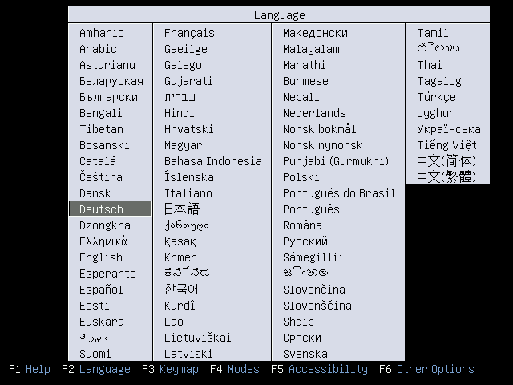
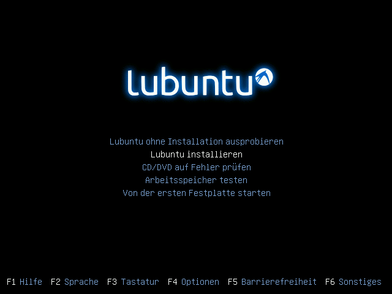
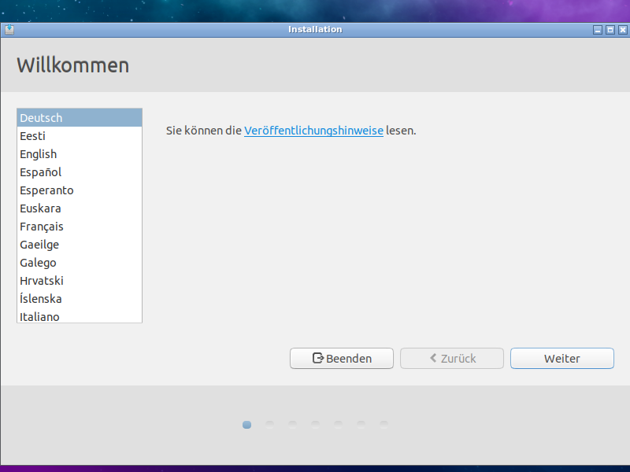
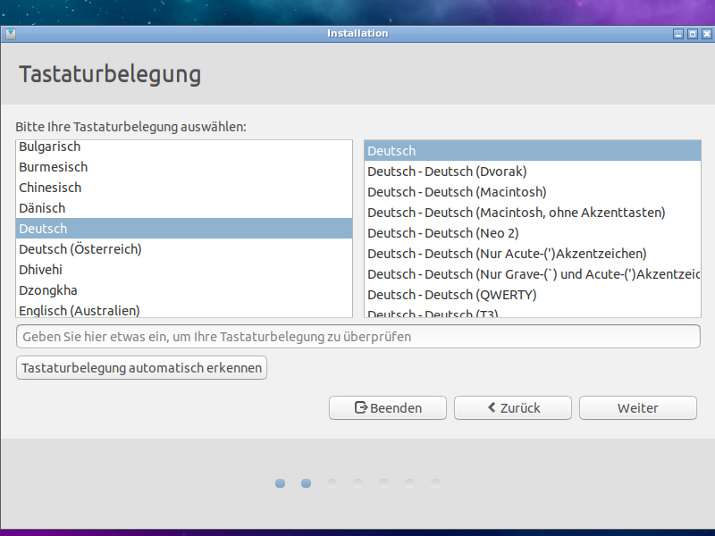
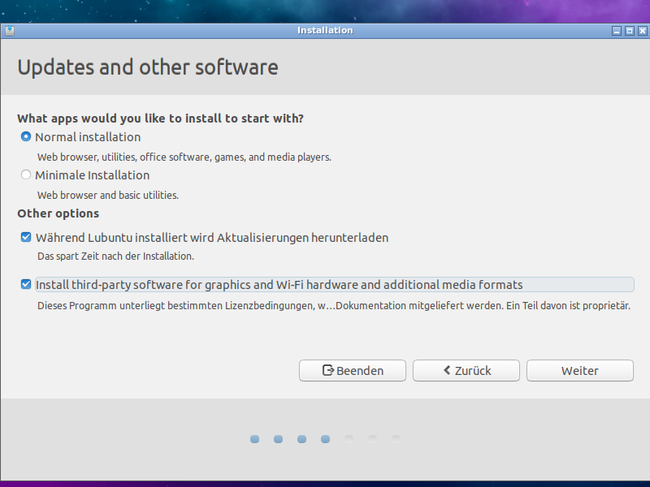
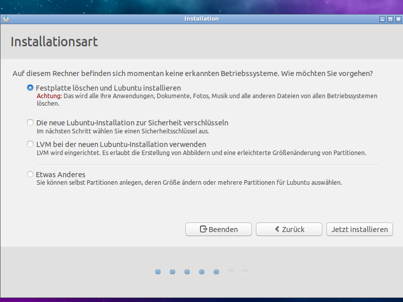
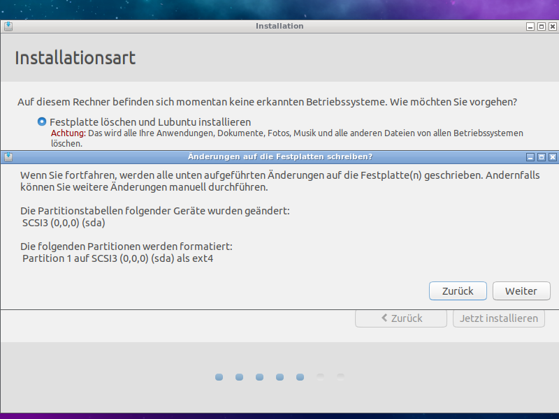
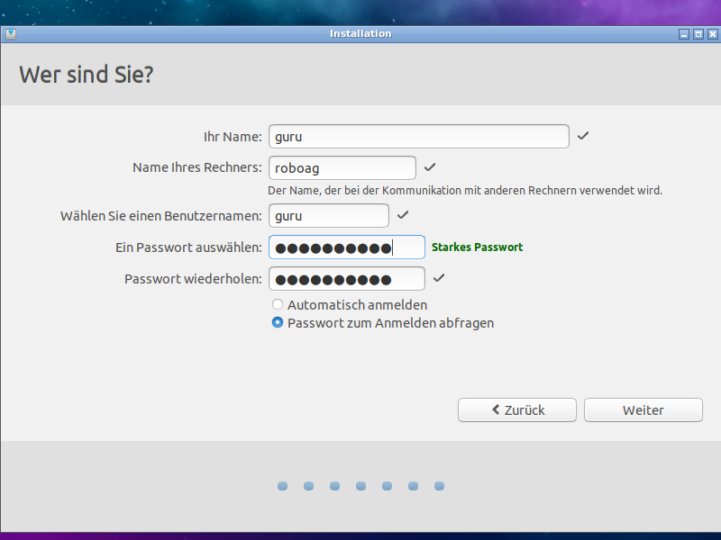
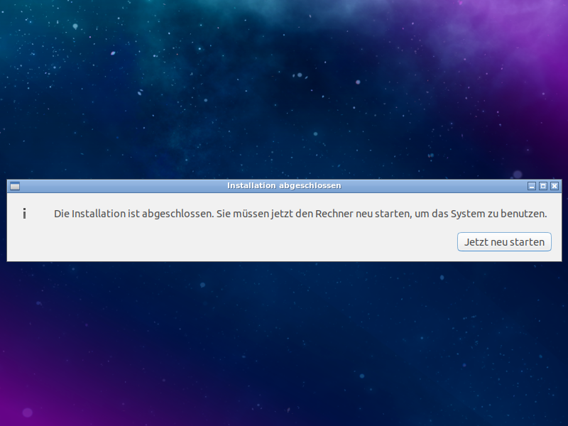

# Installationsanweisung für die Clients
Anleitung für Lubuntu 18.04

_Hinweise: es gibt eine [neuere Version](../../../README.md) dieser Anleitung_

Gegebenenfalls auch die Hilfe in den [RoboAG-Skripten](https://github.com/RoboAG/bash_roboag) nutzen:

    $ robo_help_install

**Hinterher** müssen die Clients noch [eingerichtet](../2_setup/README.md) werden.

# Bilder
## Sprache

## Auswahl

## Sprache und Keyboard

## Updates

## Installationsmodus

## Zeitzone

## Benutzer

## Neustarten

