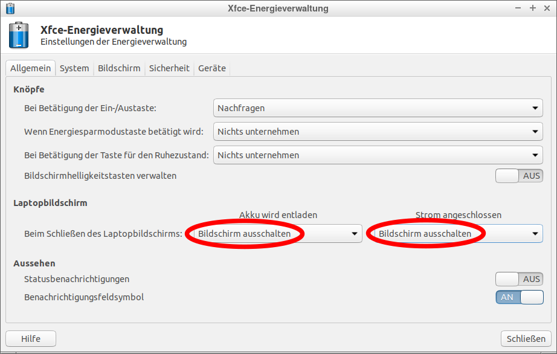

# Konfiguration für die Clients
Anleitung für Lubuntu 18.04

_Hinweise: es gibt eine [neuere Version](../../README.md) dieser Anleitung_

Bitte **vorher** die [Installation](../client_install/README.md) ausführen!

Gegebenenfalls auch die Hilfe in den [RoboAG-Skripten](https://github.com/RoboAG/bash_roboag) nutzen:

    $ robo_help_setup.sh

# Bilder
## Sprache

## Updates

## Energieverwaltung

## Fensterverwaltung

## RoboAG-Skripte

