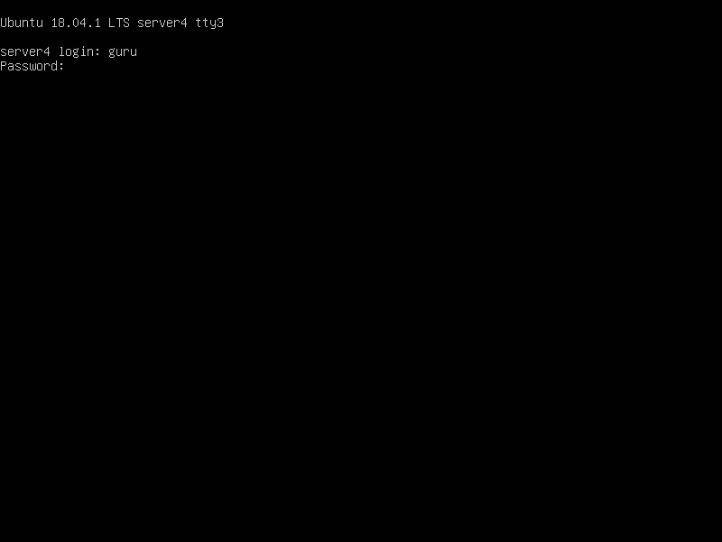
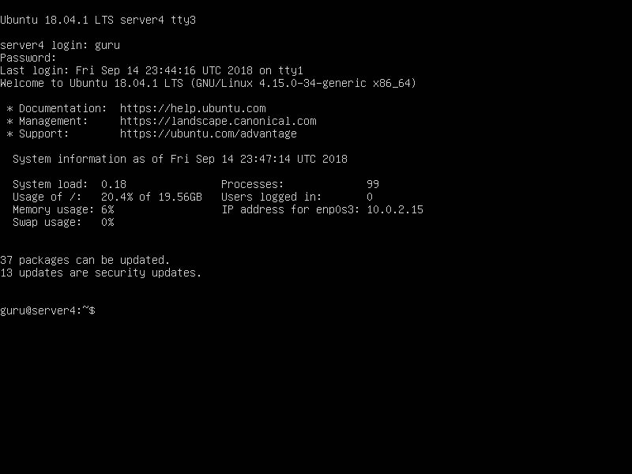
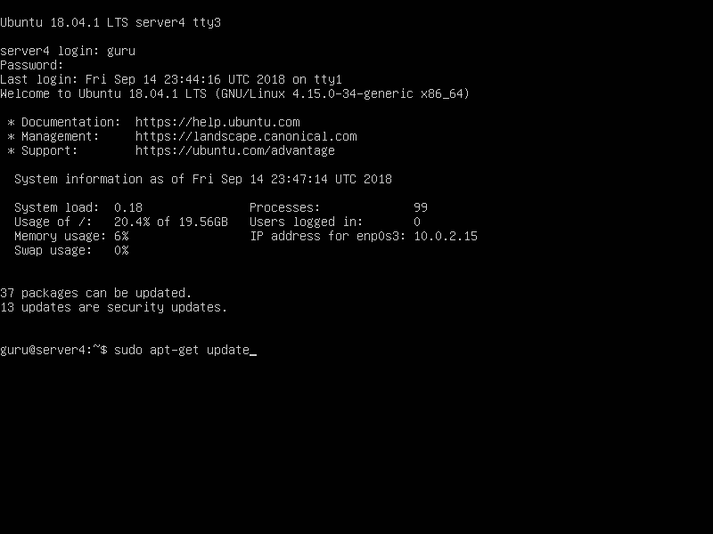
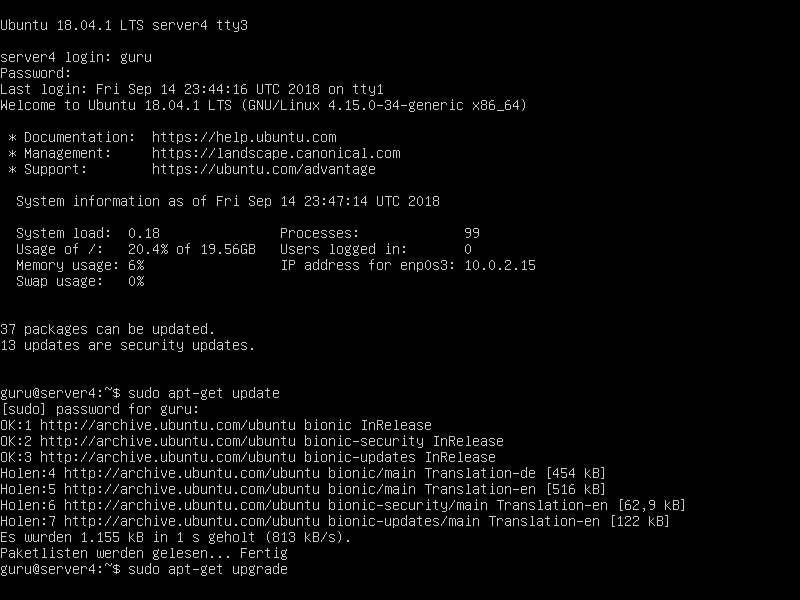
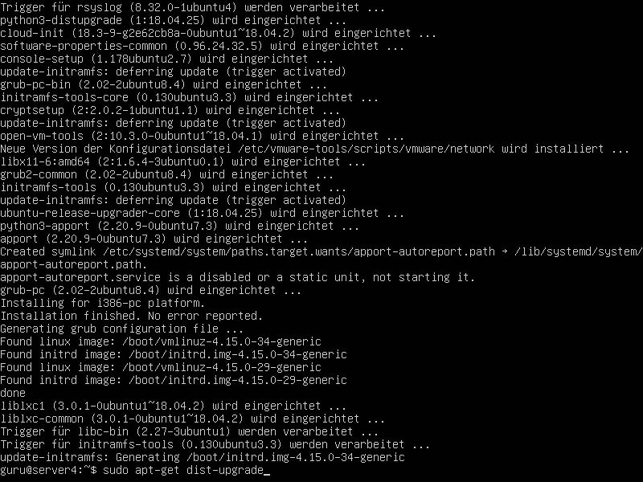
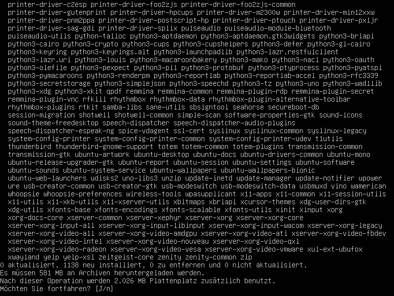
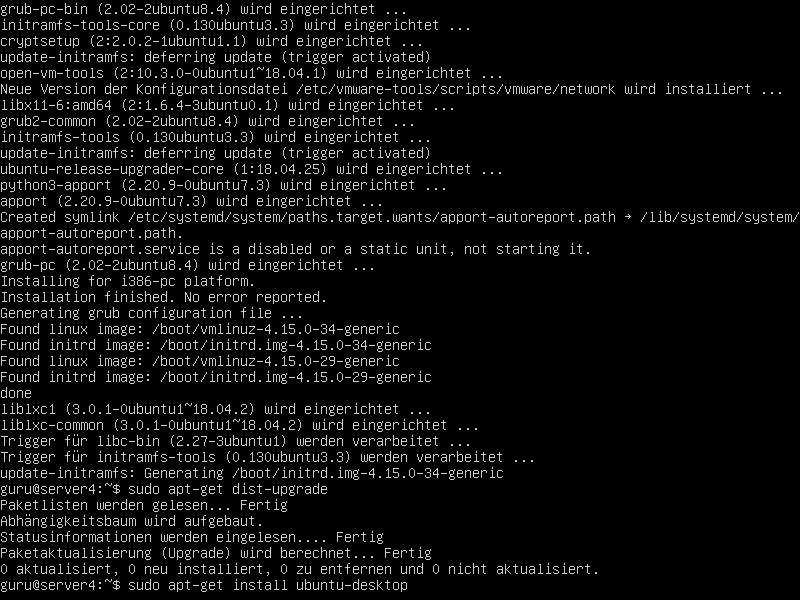
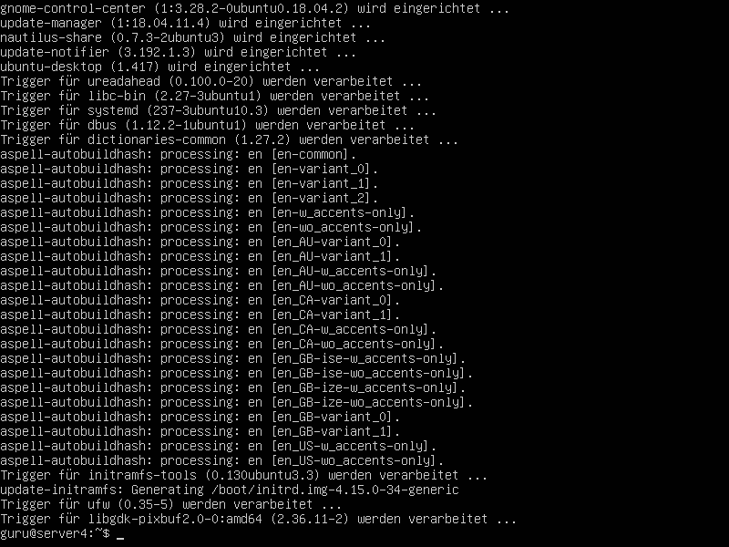
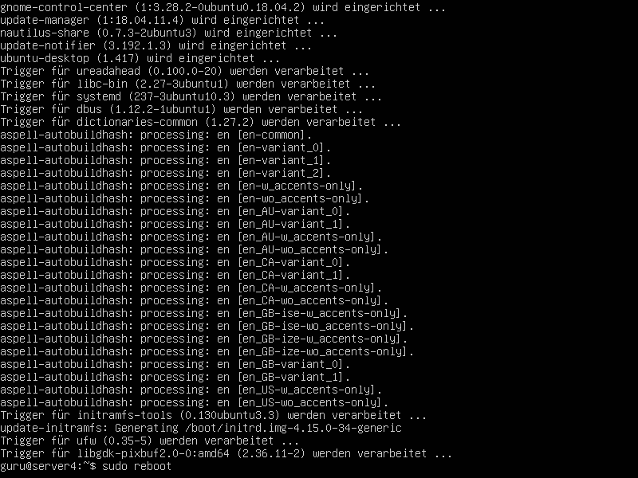

# Installation des Servers - Teil b)
Anleitung für Ubuntu Server 18.04

_Hinweise: es gibt eine [neuere Version](../../../../README.md) dieser Anleitung_

Bitte **vorher** den [Installer von Ubuntu](../1a_installer/README.md) ausführen!

Gegebenenfalls auch die Hilfe in den [RoboAG-Skripten](https://github.com/RoboAG/bash_roboag) nutzen:

    $ robo_help_install_server

**Hinterher** sollte das [Setup](../../2_setup/README.md) durchgeführt werden.

# Bilder
## Login via Terminal

## System aktualisieren

## Desktop installieren

## Neustarten

