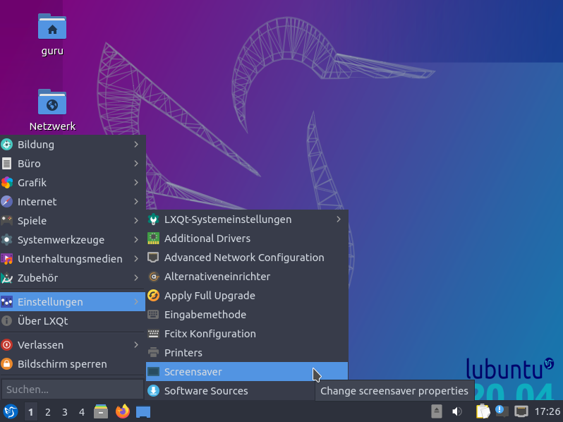
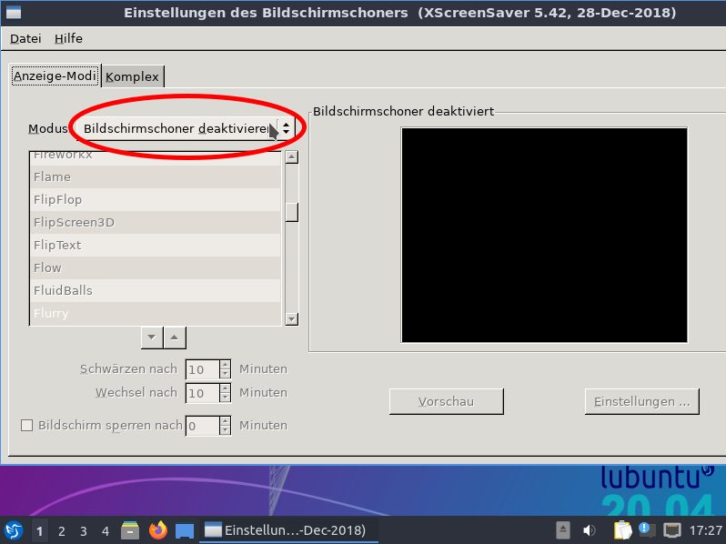
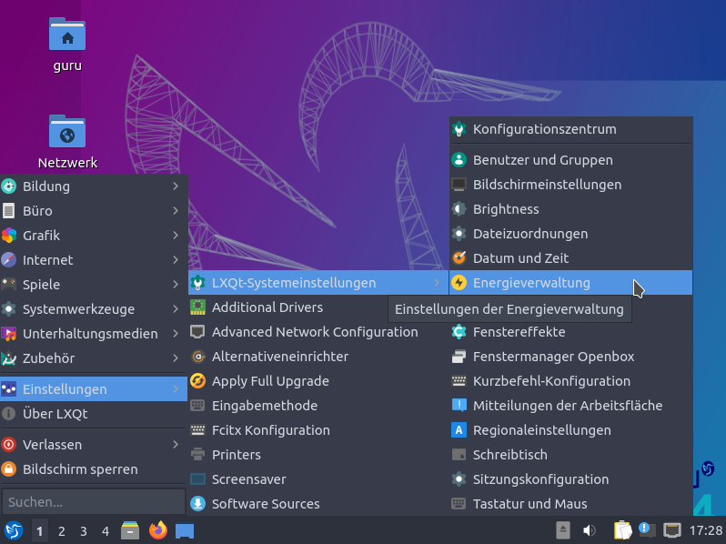
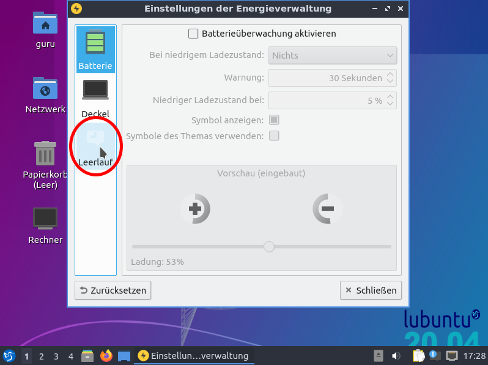
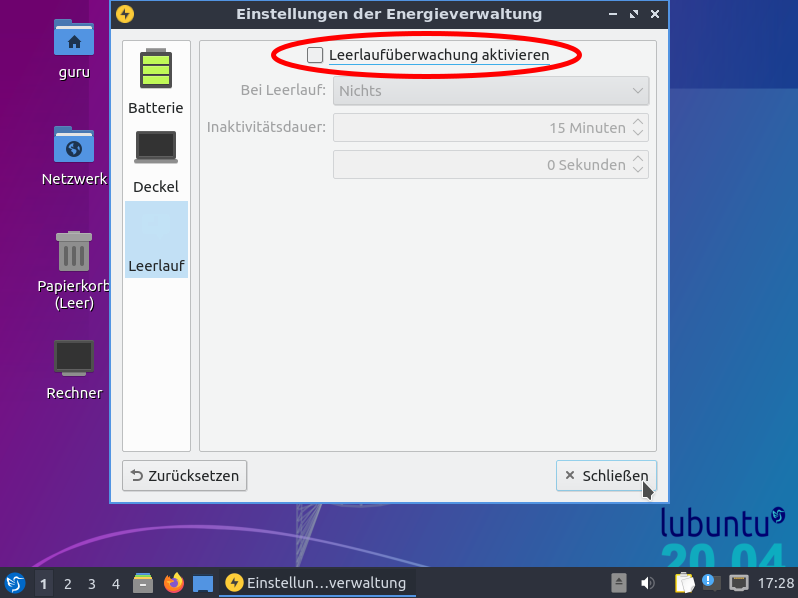
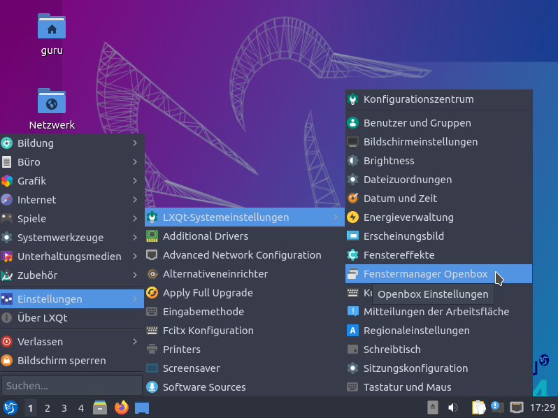
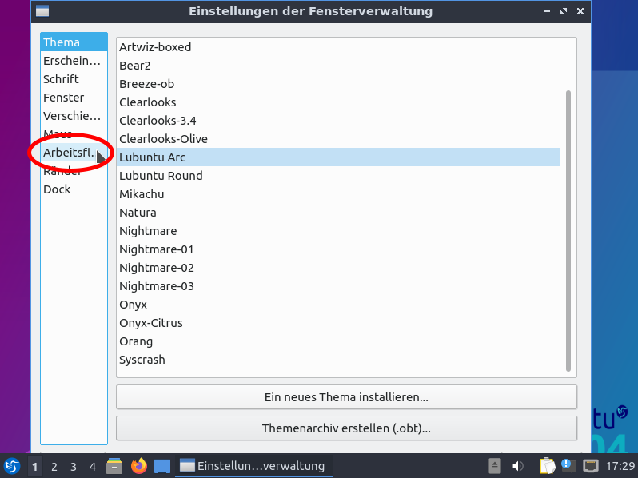
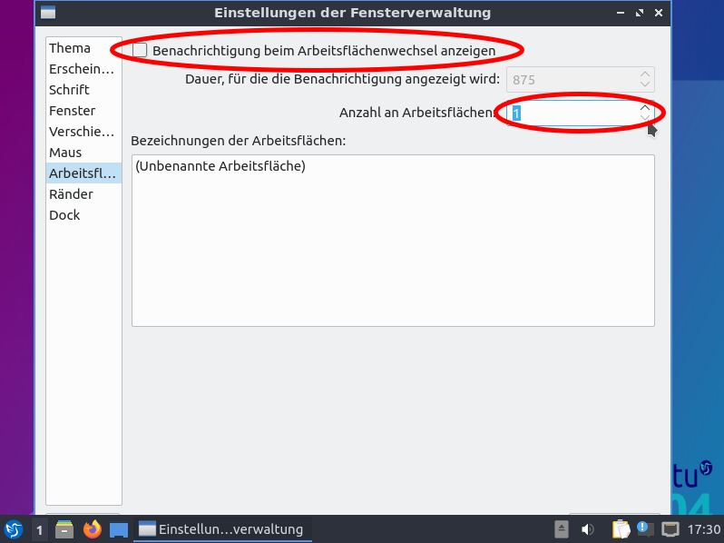

# Benutzerspezifische Konfiguration für die Clients
Anleitung für Lubuntu 20.04

Diese Einstellungen sollten für alle Benutzer (guru und roboag) einzeln
gesetzt werden.

# Bilder
## Bildschirmschoner deaktivieren

## Energieeinstellungen

## Arbeitsflächen konfigurieren

