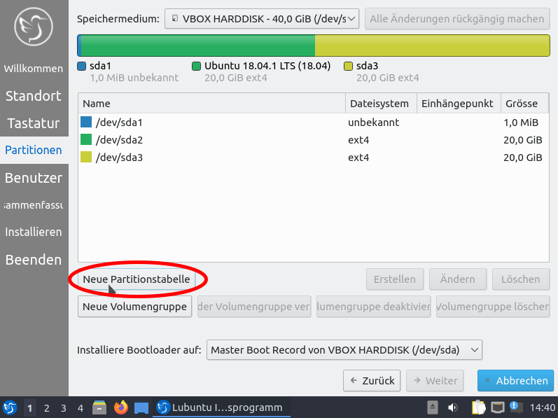

# Installationsanweisung für die Clients
Anleitung für Lubuntu 20.04

Gegebenenfalls auch die Hilfe in den [RoboAG-Skripten](https://github.com/RoboAG/bash_roboag) nutzen:

    $ robo_help_install

**Hinterher** müssen die Clients noch [eingerichtet](../client_setup/README.md) werden.

# Bilder
## Sprache wählen und LiveCD starten

_... lange warten ..._

## Installationsprogramm ausführen

## Zeitzone und Keyboard

## Partitionierung

### 0. Festplatte löschen

### 1. Root-Partition

Für die Root-Partition sollten zwischen 30GB und **50GB** genutzt werden. \
_Hinweis: im Beispiel waren insgesamt für alle Partitionen nur 40GB verfügbar_

### 2. Swap-Partition

Die Swap-Partition kann 5 bis **10GB** groß sein. \
_Hinweis: falls zu wenig Speicher verfügbar ist, kann auf diese Partition_
_verzichtet werden_

### 3. home-Partition

Die home-Partition kann 10 bis **20GB** groß sein.

### 4. Backup-Partition

Die Backup-Partition nimmt den kompletten verbleibenden Platz ein.

### Überblick

## Benutzer anlegen

## Installation starten

