# Setup für die Clients
Anleitung für Lubuntu 20.04

Bitte **vorher** die [Installation](../client_install/README.md) ausführen!

Gegebenenfalls auch die Hilfe in den [RoboAG-Skripten](https://github.com/RoboAG/bash_roboag) nutzen:

    $ robo_help_install

**Hinterher** sollten die Clients noch für jeden Benutzer
[konfiguriert](../client_config/README.md) werden.

_Hinweis: Konsole mit [strg]+[alt]+[t] öffnen und hinterher z.B. mit [strg]+[d] schließen_

# Bilder
## Erste Anmelden und Updates
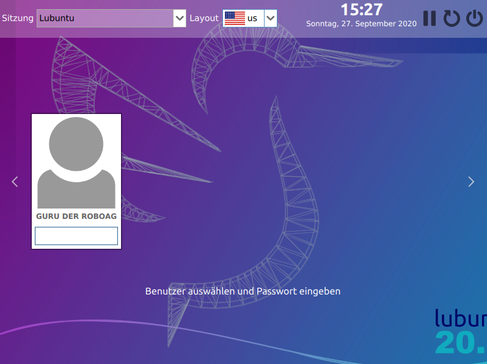
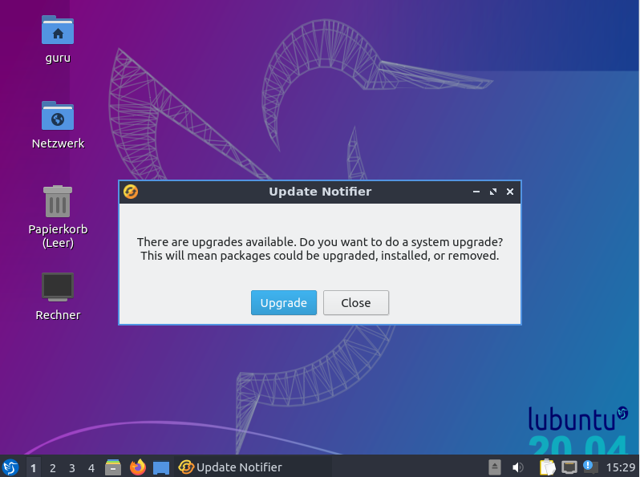

## RoboAG-Skripte auschecken

    # Konsole öffnen (<strg>+<alt>+<t>)
    $ sudo mkdir -p /opt/roboag/repos
    $ sudo chown guru:guru /opt/roboag/repos
    $ cd /opt/roboag/repos
    $ wget raw.githubusercontent.com/RoboAG/bash_roboag/master/checkout.sh

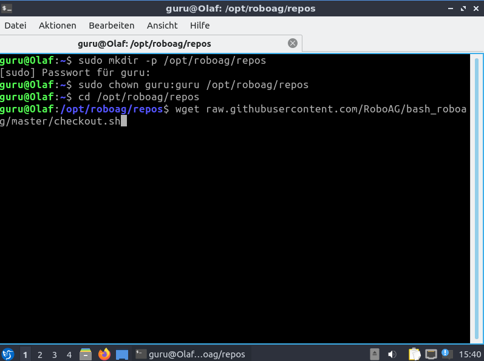
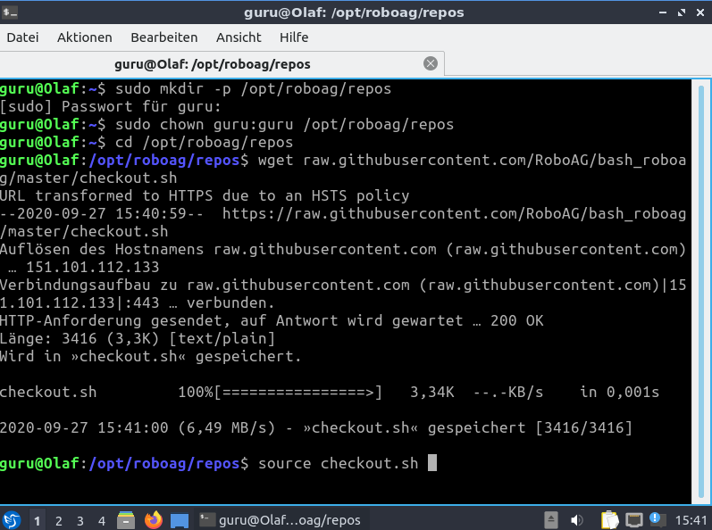

    $ source checkout.sh
        # Fragen mit "yes" beantworten

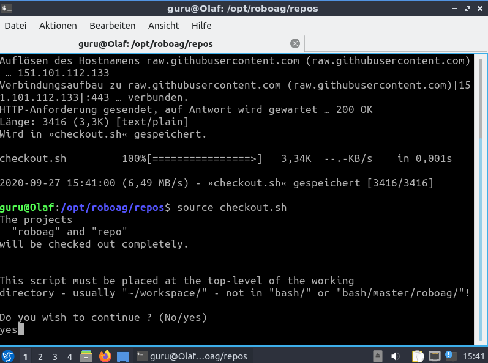

    # hinterher Konsole schließen (<strg>+<d>)

## Repositorys herunterladen

    # Konsole öffnen (<strg>+<alt>+<t>)
    $ repo_clone_all
        # Frage mit "yes" beantworten

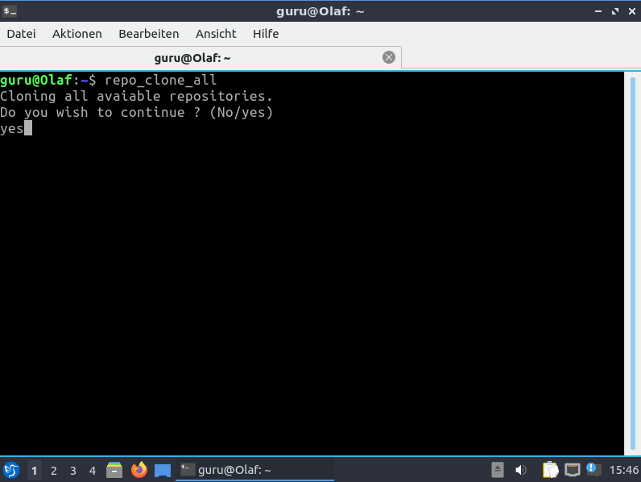
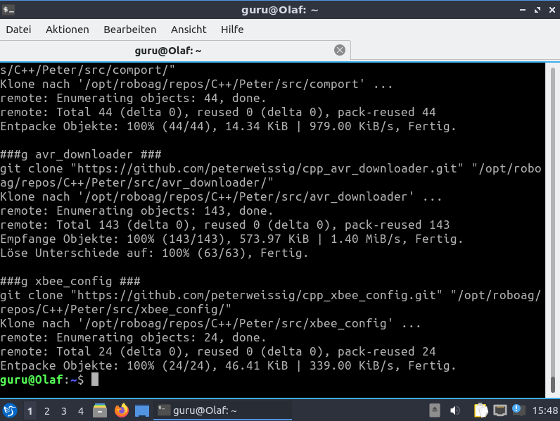

    # hinterher Konsole schließen (<strg>+<d>)

## Globale Einstellungen setzen

    # Konsole öffnen (<strg>+<alt>+<t>)
    $ config_bash_search
        # Frage mit "yes" beantworten
    $ config_clear_home
        # Frage mit "yes" beantworten

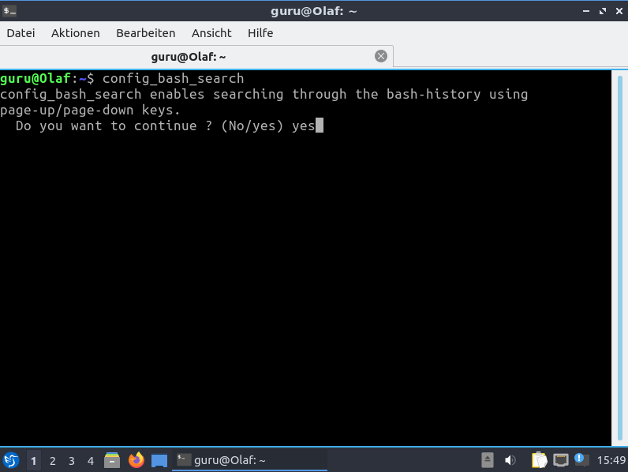
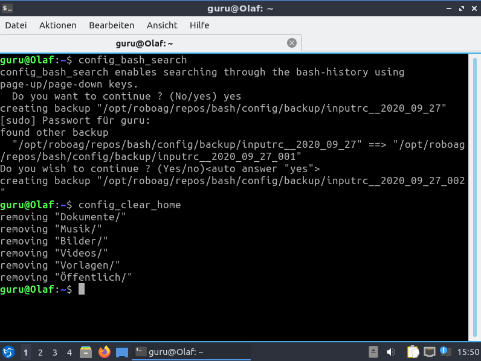

    # hinterher Konsole schließen (<strg>+<d>)

## Benutzer RoboAG anlegen

    # Konsole öffnen (<strg>+<alt>+<t>)
    $ sudo adduser roboag
        # neues Passwort eingeben (2x)
        # Name eingeben: RoboAG
        # die nächsten 4 Felder frei lassen (Zimmer, Telefon, Sonstiges)
        # Frage mit "J" beantworten (oder ebenfalls leer lassen)

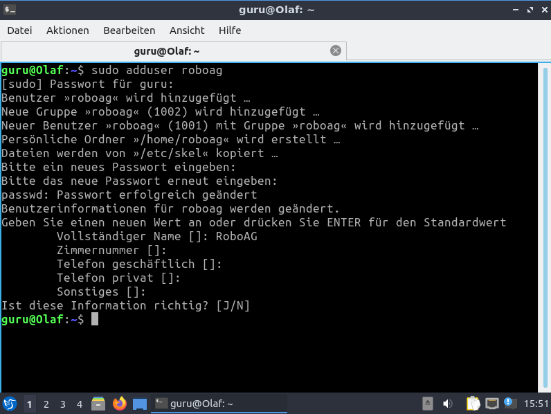

    $ sudo addgroup guru roboag

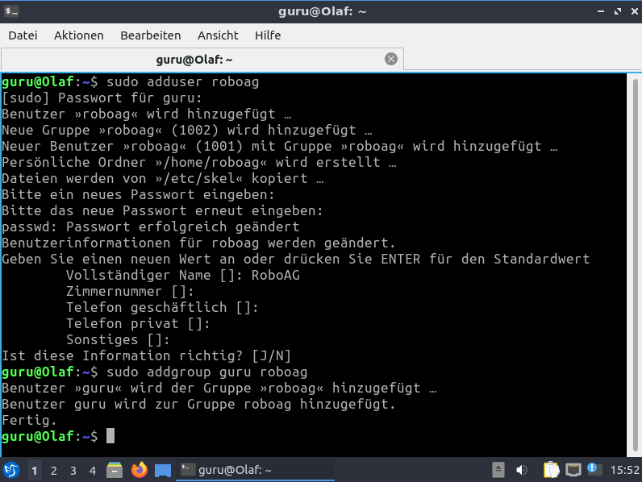

    $ sudo addgroup roboag dialout
    $ sudo addgroup roboag plugdev

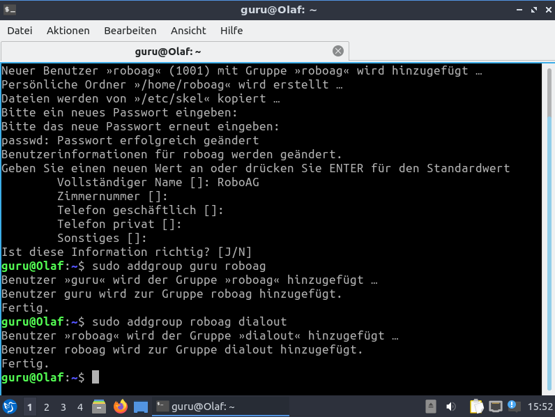
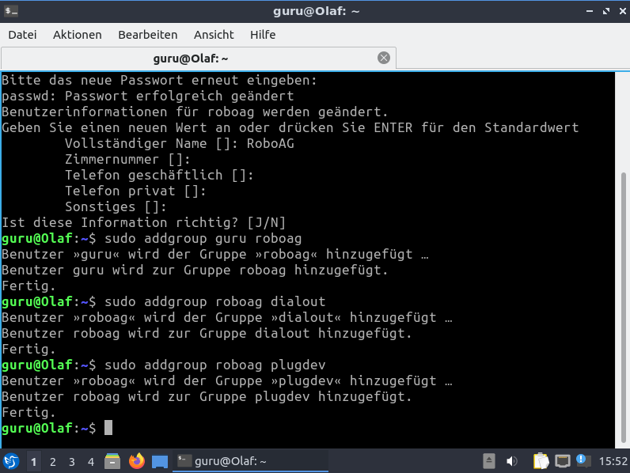

## Samba-Freigabe

    $ sudo mkdir -p /mnt/roboag
    $ sudo mkdir -p /mnt/robosax

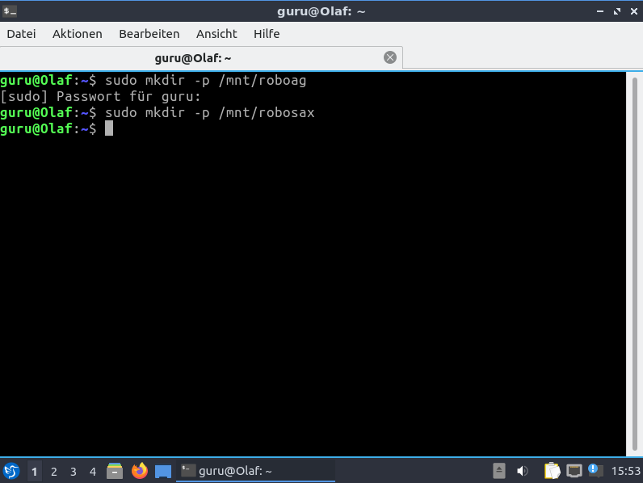

_... todo ..._

## Herunterfahren
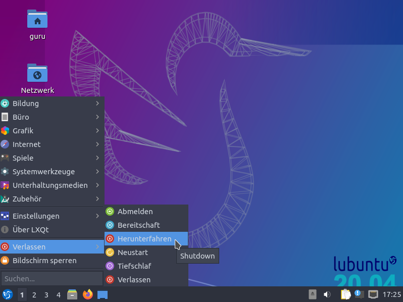
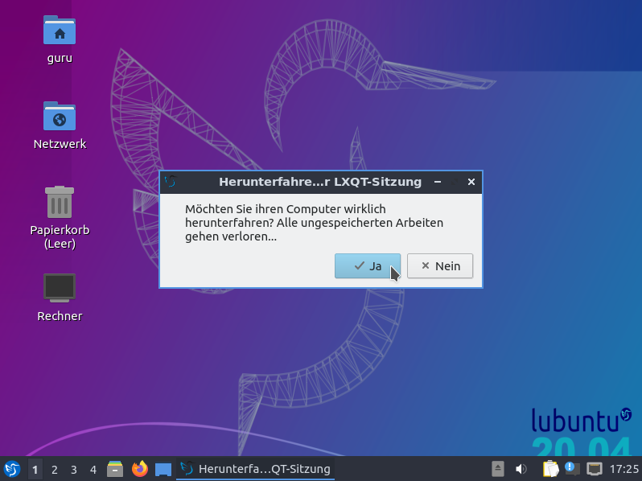
